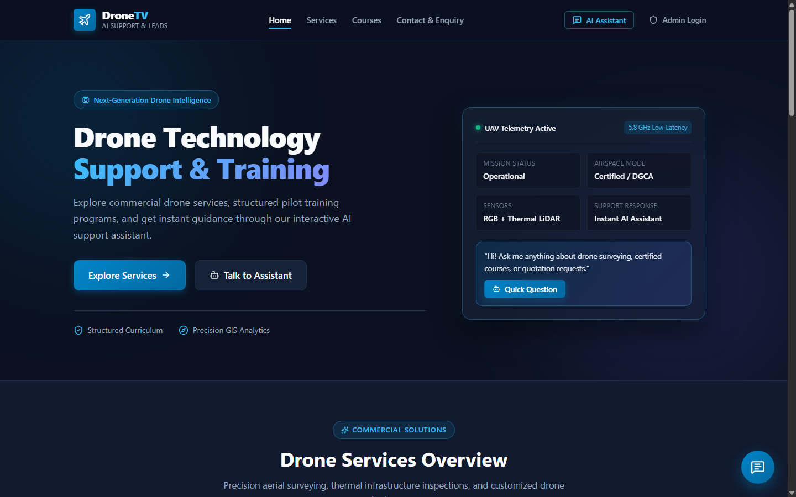
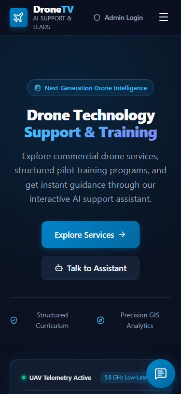
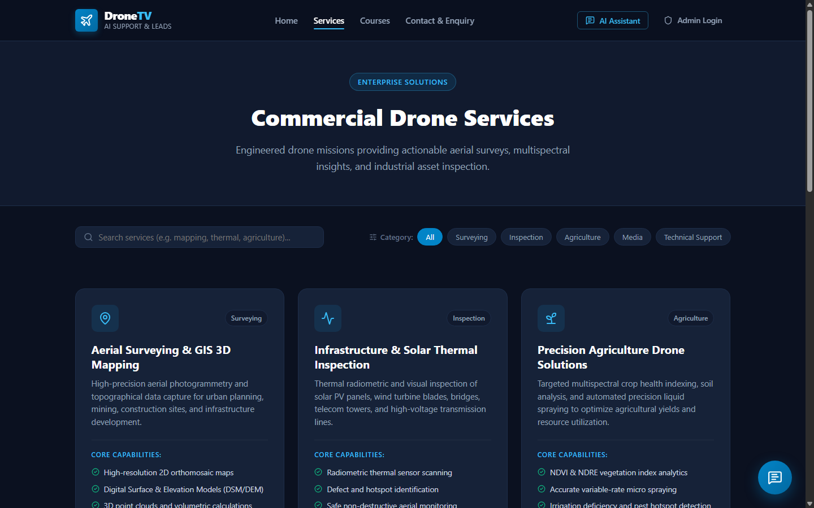
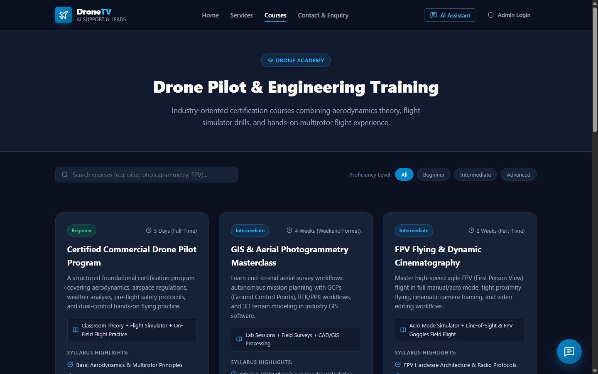
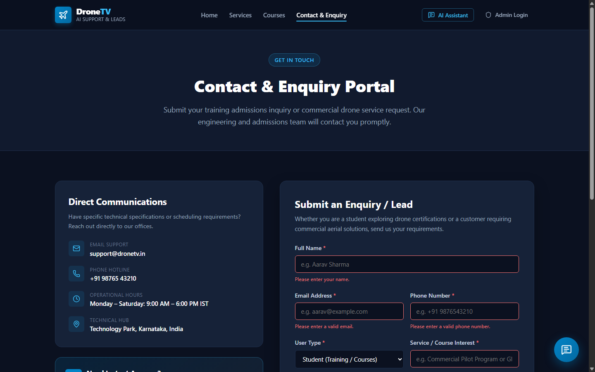
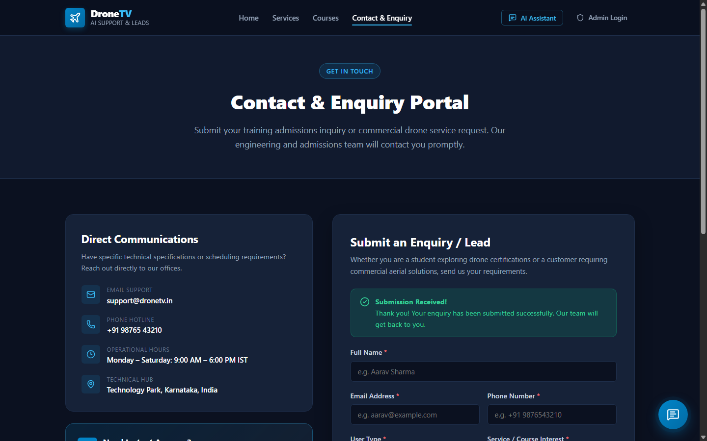
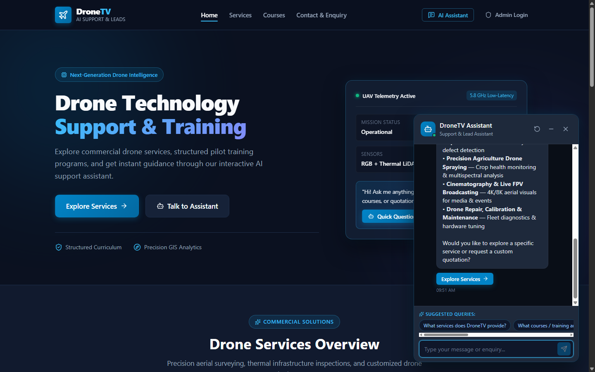
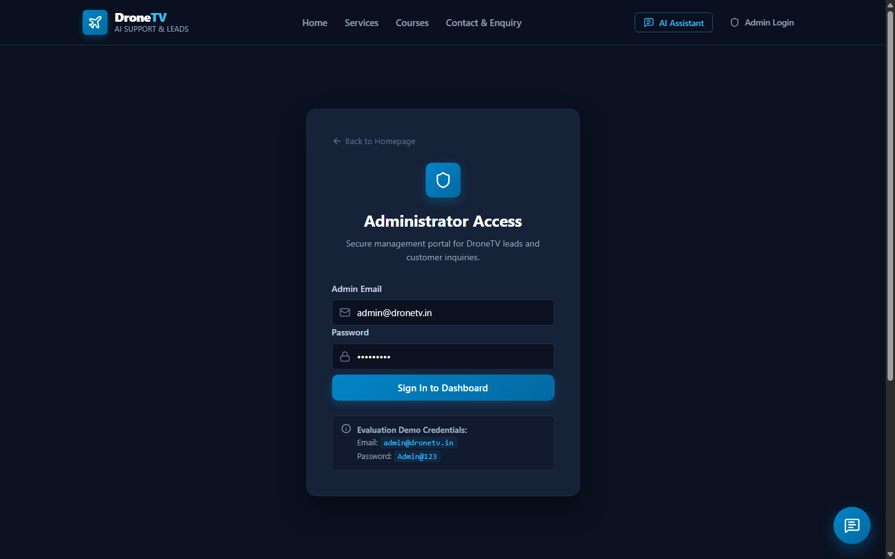
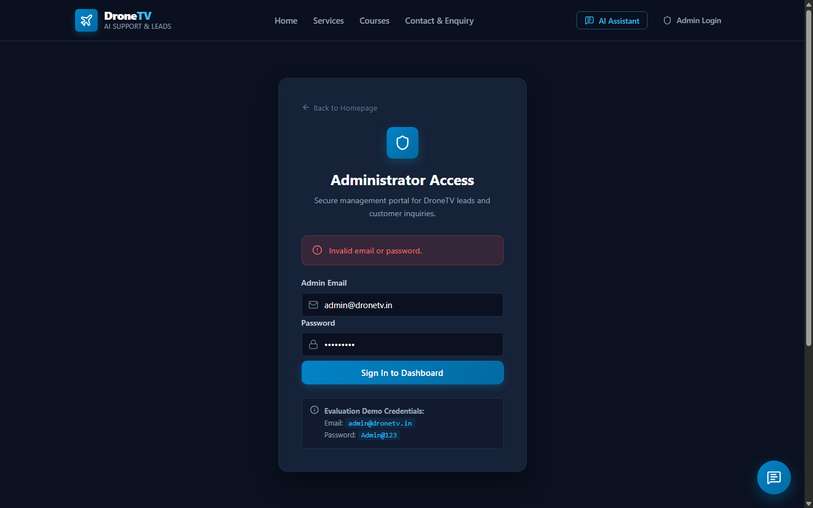
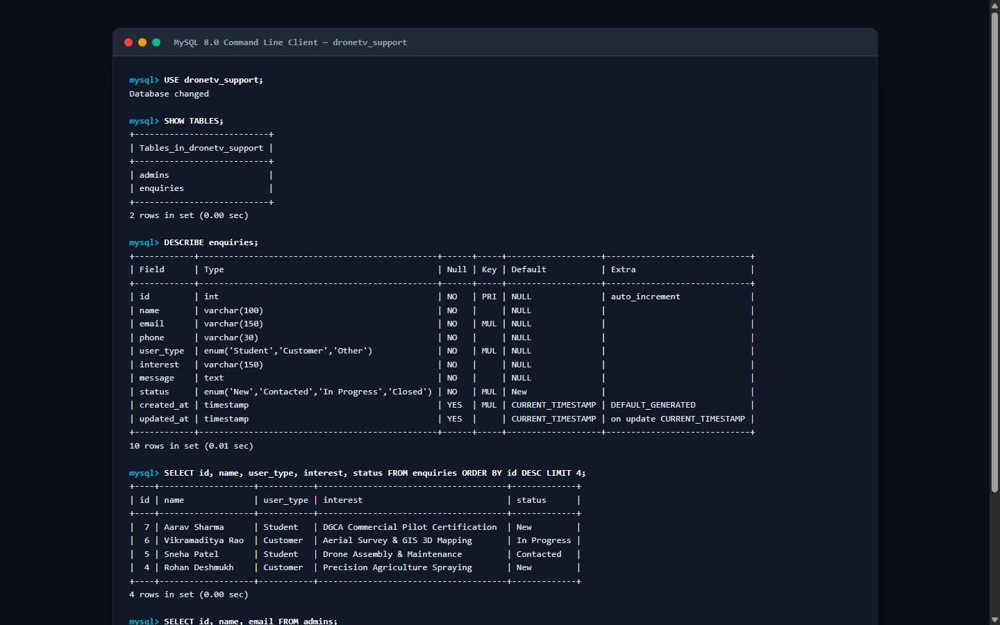

<div align="center">

# 🚁 DroneTV AI Support & Lead Assistant

**A production-quality full-stack web application for DroneTV — featuring a rule-based AI chatbot, lead management, and an admin dashboard.**



[](https://nodejs.org)
[](https://react.dev)
[](https://www.typescriptlang.org)
[](https://www.mysql.com)
[](https://expressjs.com)
[](https://vitejs.dev)

> Developed as a practical technical assignment for the **Full Stack Developer Intern** role at **IPAGE Group**.

</div>

---

## 📌 Table of Contents

1. [Project Description](#-project-description)
2. [Technologies Used](#-technologies-used)
3. [Features](#-features)
4. [Screenshots](#-screenshots)
5. [Environment Variables](#-environment-variables)
6. [Database Setup](#-database-setup)
7. [Setup Instructions](#-setup-instructions)
8. [How to Run](#-how-to-run)
9. [API Endpoints](#-api-endpoints)
10. [Project Structure](#-project-structure)
11. [AI Chatbot Architecture](#-ai-chatbot-architecture)
12. [Admin Dashboard](#-admin-dashboard)
13. [Security](#-security)
14. [Author](#-author)

---

## 🌟 Project Description

**DroneTV AI Support & Lead Assistant** is an original, drone-technology-inspired platform that connects aspiring commercial pilots, agricultural enterprises, and industrial clients with DroneTV's services and certification programs.

The platform provides:

- **Responsive Frontend** built with React 19 + TypeScript + Vite, tested across all screen sizes (320 px → 1440 px+).
- **Rule-Based AI Chatbot** — a floating assistant that matches queries to predefined intents, offers quick-question chips, delivers interactive action buttons, and gracefully falls back for unknown queries (with optional local Ollama LLM).
- **Lead Capture & Enquiry Management** — dual-layer validation (client + server), XSS sanitization, and automated routing.
- **RESTful Express API** — clean controller-service architecture with JWT-protected administrative endpoints.
- **Relational MySQL Database** — normalized schema with optimized indexes, parameterized queries, and seed data.

---

## 🛠 Technologies Used

| Layer | Technology | Version |
|:---|:---|:---|
| **Frontend** | React | 19 |
| | TypeScript | 5.x |
| | Vite | 8.x |
| | React Router DOM | v7 |
| | Axios | latest |
| | Lucide React | latest |
| | CSS3 | — |
| **Backend** | Node.js | v18+ |
| | Express.js | 4.x |
| | TypeScript | 5.x |
| | ts-node-dev | 2.x |
| | cors, dotenv | latest |
| **Database** | MySQL Community Server | 8.0+ |
| | mysql2/promise pool | 3.x |
| **Security** | bcryptjs | 2.x |
| | jsonwebtoken (JWT) | 9.x |
| | XSS input sanitization | — |
| | Parameterized SQL | — |
| **AI (optional)** | Ollama (local LLM) | any |
| | Rule-based keyword engine | primary |

---

## 🚀 Features

### 1. 🖥️ Modern Responsive Frontend

| Route | Page | Description |
|:---|:---|:---|
| `/` | **Home** | Hero section with drone HUD telemetry, services & courses preview, Why DroneTV section |
| `/services` | **Services Catalog** | Aerial surveying, solar inspection, precision agriculture, cinematography, fleet maintenance — with live search & category filtering |
| `/courses` | **Courses & Training** | DGCA certification, GIS photogrammetry, FPV cinematography, drone assembly — with level filter |
| `/contact` | **Contact & Lead Portal** | Validated lead form with auto-prefill from chatbot/service CTAs |
| `/admin/login` | **Admin Login** | Secure JWT-based administrator authentication |
| `/admin` | **Admin Dashboard** | Real-time metrics, search, filters, lead inspection modal, status updates, delete |

### 2. 🤖 Rule-Based AI Chatbot

- Floating launcher (bottom-right) with minimize, close, and clear-chat controls
- Session-persisted conversation history via `sessionStorage` (`dronetv_chat_history`)
- Handles **all 7 required client questions**:
  1. *What services does DroneTV provide?*
  2. *What courses / training are available?*
  3. *How can I contact DroneTV?*
  4. *How can I register?*
  5. *I am interested in a service.*
  6. *I am a student.*
  7. *I want to speak with someone.*
- Interactive action buttons (`[Explore Services]`, `[Send Service Enquiry]`, `[Register Now]`) that deep-link to pages with pre-filled fields
- Graceful fallback for unknown queries with recommended topics
- Animated typing indicator (`Assistant is typing...`)
- Client-side rule engine auto-activates if backend is offline

### 3. 📋 Lead & Enquiry Management

- Captures: `name`, `email`, `phone`, `userType` (Student / Customer / Other), `interest`, `message`
- Full dual-layer validation — client-side (regex, length) + server-side
- XSS-sanitized inputs, safe error messages — never exposes stack traces

### 4. 🔐 Admin Management Dashboard

- JWT-protected route — redirects to login if token missing
- **Pipeline counters:** Total Leads, New, Contacted, In Progress, Closed
- **Multi-field search** — Name, Email, Phone, Interest
- **Filter pills** — User Type & Status
- Responsive desktop table + mobile card layout
- **View modal** — full enquiry text, timestamps, customer metadata
- **Status update** — inline dropdown with immediate persistence
- **Safe deletion** — confirmation modal before removing records

---

## 📸 Screenshots

### 🏠 Landing Page — Desktop (1440 px)


---

### 📱 Landing Page — Mobile (375 px)


---

### ⚙️ Services Catalog


---

### 🎓 Courses & Training


---

### 📝 Enquiry Form — Validation Errors


---

### ✅ Enquiry Form — Successful Submission


---

### 💬 Chatbot — Answering Predefined Queries


---

### 🔄 Chatbot — Graceful Fallback Response


---

### 🔑 Admin Login Page


---

### 📊 Admin Dashboard — Lead Pipeline


---

### 🔍 Admin — Full Enquiry Inspection Modal


---

### 🗄️ MySQL Database — Schema & Records


---

## ⚙️ Environment Variables

Create `backend/.env` from the provided `backend/.env.example`:

```env
# Server
PORT=5000
NODE_ENV=development

# Database Configuration
DB_HOST=localhost
DB_PORT=3306
DB_NAME=dronetv_support
DB_USER=root
DB_PASSWORD=your_mysql_password_here

# Security
JWT_SECRET=dronetv_jwt_super_secret_key_2025_internship
JWT_EXPIRES_IN=24h

# Optional Ollama Configuration (local LLM fallback)
OLLAMA_BASE_URL=http://localhost:11434
OLLAMA_MODEL=qwen2.5-coder:7b
```

> **Resilient Execution:** If MySQL credentials are missing or MySQL is offline, the backend automatically activates a fail-safe in-memory database with seed data. The server never crashes — all features remain fully evaluable immediately.

---

## 🗄 Database Setup

### Prerequisites

- MySQL Community Server **8.0+** installed and running
- A MySQL user with CREATE DATABASE privileges

### Step 1 — Open MySQL CLI

```bash
mysql -u root -p
```

### Step 2 — Run Schema & Seed Files

```sql
SOURCE backend/sql/schema.sql;
SOURCE backend/sql/seed.sql;
```

Or from the project root (bash / PowerShell):

```bash
mysql -u root -p < backend/sql/schema.sql
mysql -u root -p < backend/sql/seed.sql
```

### Tables Created

#### `admins`

| Column | Type | Description |
|:---|:---|:---|
| `id` | INT AUTO_INCREMENT PK | Unique admin ID |
| `name` | VARCHAR(100) | Admin display name |
| `email` | VARCHAR(150) UNIQUE | Login email |
| `password_hash` | VARCHAR(255) | bcrypt-hashed password |
| `created_at` | TIMESTAMP | Record creation time |
| `updated_at` | TIMESTAMP | Last modification time |

#### `enquiries`

| Column | Type | Description |
|:---|:---|:---|
| `id` | INT AUTO_INCREMENT PK | Unique enquiry ID |
| `name` | VARCHAR(100) | Submitter name |
| `email` | VARCHAR(150) | Contact email |
| `phone` | VARCHAR(30) | Contact phone |
| `user_type` | ENUM | `Student`, `Customer`, `Other` |
| `interest` | VARCHAR(150) | Service or course of interest |
| `message` | TEXT | Full enquiry message |
| `status` | ENUM | `New`, `Contacted`, `In Progress`, `Closed` |
| `created_at` | TIMESTAMP | Submission timestamp |
| `updated_at` | TIMESTAMP | Last status change |

**Indexes:** `email`, `user_type`, `status`, `created_at` — for high-performance filtering.

### Default Admin Credentials (from seed)

| Field | Value |
|:---|:---|
| **Email** | `admin@dronetv.in` |
| **Password** | `Admin@123` |

> The password is stored as a bcrypt hash (`$2a$10$TjsS.Dpsrv/ICOL0xqQUHO...`).

---

## 🔧 Setup Instructions

### Prerequisites

Ensure the following are installed:

- **Node.js** v18.0.0+ (tested on v22 & v25)
- **npm** v9.0.0+
- **MySQL Community Server** v8.0+
- **Git**
- *(Optional)* **Ollama** — for local LLM fallback (`ollama pull qwen2.5-coder:7b`)

### Clone & Install

```bash
# Clone the repository
git clone <your-repository-url>
cd FullStack_Chatbot_Task_{Rakesh}_{Karikatti}

# Install ALL dependencies at once (frontend + backend)
npm run install:all
```

Or install separately:

```bash
# Backend
cd backend
npm install

# Frontend
cd ../frontend
npm install
```

### Configure Environment

```bash
# Copy the example env file
copy backend\.env.example backend\.env

# Edit backend/.env and fill in your MySQL password
```

### Setup Database

```bash
mysql -u root -p < backend/sql/schema.sql
mysql -u root -p < backend/sql/seed.sql
```

---

## ▶️ How to Run

### Development Mode (Recommended)

Open **two terminal windows**:

**Terminal 1 — Backend:**

```bash
cd backend
npm run dev
```

```
🚀 DroneTV Backend Server running on port 5000
📡 Base API URL: http://localhost:5000/api
🩺 Health Check: http://localhost:5000/api/health
```

**Terminal 2 — Frontend:**

```bash
cd frontend
npm run dev
```

```
VITE ready in ~1600 ms

  ➜  Local:   http://localhost:5173/
  ➜  Network: use --host to expose
```

Open your browser at: **[http://localhost:5173](http://localhost:5173)**

---

### Production Build

```bash
# Build backend
cd backend
npm run build        # Outputs to backend/dist/

# Start backend in production
npm start

# Build frontend
cd ../frontend
npm run build        # Outputs to frontend/dist/
```

### Root Monorepo Scripts

From the project root, you can also run:

```bash
npm run install:all   # Install all dependencies
npm run dev           # Start both frontend & backend (if concurrently configured)
```

---

## 📡 API Endpoints

### Base URL

```
http://localhost:5000/api
```

### System

| Method | Endpoint | Auth Required | Description |
|:---|:---|:---:|:---|
| `GET` | `/health` | ❌ | System health check & database connectivity status |

### Authentication (`/auth`)

| Method | Endpoint | Auth Required | Description |
|:---|:---|:---:|:---|
| `POST` | `/auth/login` | ❌ | Admin login — returns signed JWT |
| `POST` | `/auth/logout` | ✅ JWT | Invalidate admin session |
| `GET` | `/auth/me` | ✅ JWT | Verify token & get current admin profile |

**Login Request Body:**

```json
{
  "email": "admin@dronetv.in",
  "password": "Admin@123"
}
```

**Login Response:**

```json
{
  "success": true,
  "message": "Login successful",
  "data": {
    "token": "eyJhbGciOiJIUzI1NiIsInR5cCI6IkpXVCJ9...",
    "admin": {
      "id": 1,
      "name": "Lead Administrator",
      "email": "admin@dronetv.in"
    }
  }
}
```

### Chatbot (`/chat`)

| Method | Endpoint | Auth Required | Description |
|:---|:---|:---:|:---|
| `POST` | `/chat` | ❌ | Process a chatbot message — returns intent-matched response |

**Request Body:**

```json
{
  "message": "What services does DroneTV provide?"
}
```

**Response:**

```json
{
  "success": true,
  "data": {
    "reply": "DroneTV offers a wide range of professional drone services...",
    "actions": [
      { "label": "Explore Services", "path": "/services" }
    ],
    "intent": "services",
    "source": "rule-based"
  }
}
```

### Enquiries (`/enquiries`)

| Method | Endpoint | Auth Required | Description |
|:---|:---|:---:|:---|
| `POST` | `/enquiries` | ❌ | Submit a new student or customer lead |
| `GET` | `/enquiries` | ✅ JWT | List enquiries with search, filter & pipeline stats |
| `GET` | `/enquiries/:id` | ✅ JWT | Retrieve single enquiry details |
| `PATCH` | `/enquiries/:id` | ✅ JWT | Update enquiry status |
| `DELETE` | `/enquiries/:id` | ✅ JWT | Permanently remove an enquiry |

**POST `/enquiries` — Request Body:**

```json
{
  "name": "Aarav Sharma",
  "email": "aarav@example.com",
  "phone": "+91 98765 43210",
  "userType": "Student",
  "interest": "DGCA Commercial Pilot Certification",
  "message": "Interested in the weekend batch for pilot certification."
}
```

**GET `/enquiries` — Query Parameters:**

| Parameter | Type | Description |
|:---|:---|:---|
| `search` | string | Search across name, email, phone, interest |
| `userType` | string | Filter: `Student`, `Customer`, `Other` |
| `status` | string | Filter: `New`, `Contacted`, `In Progress`, `Closed` |

**GET `/enquiries` — Response:**

```json
{
  "success": true,
  "data": [ /* array of enquiry objects */ ],
  "stats": {
    "total": 12,
    "new": 5,
    "contacted": 3,
    "inProgress": 2,
    "closed": 2
  }
}
```

**PATCH `/enquiries/:id` — Request Body:**

```json
{
  "status": "Contacted"
}
```

> **Authorization Header:** `Authorization: Bearer <JWT_TOKEN>`

---

## 📁 Project Structure

```text
FullStack_Chatbot_Task_{Rakesh}_{Karikatti}/
│
├── frontend/                               # React 19 + TypeScript Frontend
│   ├── public/
│   │   ├── favicon.svg
│   │   └── icons.svg
│   ├── src/
│   │   ├── assets/                         # Static icons & graphics
│   │   ├── components/
│   │   │   ├── Navbar.tsx                  # Responsive header & hamburger
│   │   │   ├── Footer.tsx                  # Multi-column footer
│   │   │   ├── Hero.tsx                    # Landing hero with HUD telemetry
│   │   │   ├── ServiceCard.tsx             # Reusable service card
│   │   │   ├── CourseCard.tsx              # Reusable course card
│   │   │   ├── CTASection.tsx              # CTA / Enquiry prompt
│   │   │   ├── EnquiryForm.tsx             # Validated lead submission form
│   │   │   └── Chatbot/
│   │   │       ├── Chatbot.tsx             # Root chatbot widget & lifecycle
│   │   │       ├── ChatHeader.tsx          # Chat top bar & controls
│   │   │       ├── ChatMessage.tsx         # Bubbles & action buttons
│   │   │       ├── ChatInput.tsx           # Text input with submit handling
│   │   │       ├── QuickQuestions.tsx      # Quick-question suggestion chips
│   │   │       └── Chatbot.css             # Chatbot styling & mobile dock
│   │   ├── pages/
│   │   │   ├── Home.tsx                    # Landing overview
│   │   │   ├── Services.tsx                # Catalog with search & filter
│   │   │   ├── Courses.tsx                 # Training with level filter
│   │   │   ├── Contact.tsx                 # Enquiry portal & contacts
│   │   │   ├── AdminLogin.tsx              # JWT administrator login
│   │   │   ├── AdminDashboard.tsx          # Lead management dashboard
│   │   │   └── NotFound.tsx                # 404 handler
│   │   ├── data/
│   │   │   ├── services.ts                 # Service definitions
│   │   │   ├── courses.ts                  # Training curriculums
│   │   │   └── chatbotData.ts              # Predefined intents & quick chips
│   │   ├── types/                          # Strict TypeScript interfaces
│   │   │   ├── chatbot.ts
│   │   │   ├── course.ts
│   │   │   ├── enquiry.ts
│   │   │   └── service.ts
│   │   ├── services/
│   │   │   └── api.ts                      # Axios service & client fallback
│   │   ├── utils/
│   │   │   ├── validation.ts               # Frontend form validation
│   │   │   └── chatbot.ts                  # Client rule-based matching engine
│   │   ├── App.tsx                         # Router and global layout
│   │   ├── main.tsx                        # DOM mount
│   │   └── index.css                       # Responsive stylesheet
│   ├── package.json
│   ├── tsconfig.json
│   └── vite.config.ts
│
├── backend/                                # Node.js + Express Backend
│   ├── src/
│   │   ├── config/
│   │   │   └── database.ts                 # MySQL pool & resilient in-memory fallback
│   │   ├── controllers/
│   │   │   ├── authController.ts           # Login, logout, profile
│   │   │   ├── enquiryController.ts        # Enquiry CRUD operations
│   │   │   └── chatController.ts           # Chatbot intent router
│   │   ├── routes/
│   │   │   ├── authRoutes.ts               # /api/auth endpoints
│   │   │   ├── enquiryRoutes.ts            # /api/enquiries endpoints
│   │   │   └── chatRoutes.ts               # /api/chat endpoints
│   │   ├── middleware/
│   │   │   ├── authMiddleware.ts           # JWT Bearer verification
│   │   │   ├── errorMiddleware.ts          # Centralized error & 404 handler
│   │   │   └── validationMiddleware.ts     # Input payload validation
│   │   ├── services/
│   │   │   ├── chatbotService.ts           # Rule-based intent matcher
│   │   │   └── ollamaService.ts            # Optional Ollama connection
│   │   ├── utils/
│   │   │   ├── validation.ts               # Server-side validation
│   │   │   └── sanitize.ts                 # XSS sanitization
│   │   ├── app.ts                          # Express application setup
│   │   └── server.ts                       # Server bootstrap
│   ├── sql/
│   │   ├── schema.sql                      # DDL schema definition
│   │   └── seed.sql                        # Default admin & seed leads
│   ├── package.json
│   ├── tsconfig.json
│   ├── .env.example                        # Template — copy to .env
│   └── .env                                # Your local config (git-ignored)
│
├── 01_Source_Code/                         # Submission reference folder
├── 02_Screenshots/                         # Application screenshots
├── 03_API_Documentation/                   # REST API markdown docs
├── 04_Database/                            # SQL schema & setup guide
├── 05_Video_Walkthrough/                   # Presentation script
├── 06_GitHub/                              # GitHub submission details
├── 07_Resume/                              # Candidate resume
│
├── package.json                            # Monorepo root script runner
├── .gitignore
└── README.md
```

---

## 🤖 AI Chatbot Architecture

```text
User Message
     │
     ▼
Normalize & Clean Text (Lowercase, Punctuation Strip)
     │
     ▼
Match Predefined Intent Keywords?
 ├── YES ──→ Return Predefined Response + Action CTA Buttons
 │
 └── NO
      │
      ▼
   Optional Ollama Request (Local LLM via Backend)
      │
   ┌──┴──────────────────────────┐
   │                             │
 LLM Success               Failure / Offline
   │                             │
   ▼                             ▼
LLM Reply            Standardized Fallback Response
                     ("I can help you with: Services, Courses...")
```

### Supported Predefined Intents

| Intent | Keywords / Trigger | Action Button |
|:---|:---|:---|
| `services` | "services", "what do you offer", "aerial" | `[Explore Services]` → `/services` |
| `courses` | "courses", "training", "certification", "learn" | `[View All Courses]` → `/courses` |
| `contact` | "contact", "email", "phone", "reach" | — (provides contact info directly) |
| `registration` | "register", "enroll", "sign up", "admission" | `[Register Now]` → `/contact` |
| `service-interest` | "interested in service", "commercial", "hire" | `[Send Service Enquiry]` → `/contact` |
| `student` | "student", "beginner", "learn to fly" | — (explains student pathway) |
| `human-support` | "speak to someone", "human", "call", "agent" | — (provides phone & hours) |

---

## 📊 Admin Dashboard

### Access

Navigate to **[http://localhost:5173/admin/login](http://localhost:5173/admin/login)**

| Credential | Value |
|:---|:---|
| **Email** | `admin@dronetv.in` |
| **Password** | `Admin@123` |

### Capabilities

| Feature | Description |
|:---|:---|
| **Pipeline Stats** | Live counters: Total, New, Contacted, In Progress, Closed |
| **Search** | Real-time search by Name, Email, Phone, Interest |
| **User Type Filter** | All / Student / Customer / Other |
| **Status Filter** | All / New / Contacted / In Progress / Closed |
| **View Modal** | Full enquiry text, timestamps, customer metadata |
| **Status Update** | Inline dropdown — persisted instantly to MySQL |
| **Delete** | Safe confirmation modal before removal |

---

## 🛡 Security

| Mechanism | Implementation |
|:---|:---|
| **Password Hashing** | `bcrypt` with 10 salt rounds |
| **Authentication** | Signed JWT tokens — verified by Express middleware on all admin routes |
| **SQL Injection Prevention** | 100% parameterized queries via `pool.execute(query, [params])` |
| **XSS Sanitization** | User inputs stripped of dangerous HTML/script tags before storage |
| **Error Masking** | Production errors return safe, standardized messages — no stack traces, DB passwords, or file paths exposed |
| **Secrets Management** | `.env` excluded from git via `.gitignore` |

---

## ✅ Testing Checklist

- [x] Landing page loads with responsive HUD telemetry card
- [x] Navbar links navigate correctly; mobile hamburger toggles cleanly
- [x] Services page: all cards visible, search & category filter working
- [x] Courses page: all courses visible, level filter working
- [x] "Enquire" CTA → redirects to `/contact` with pre-filled fields
- [x] Contact page: client-side validation enforced (name ≥ 2 chars, valid email/phone, non-empty message)
- [x] 404 page handles unknown routes gracefully
- [x] Chatbot floating toggle opens/closes
- [x] Session storage preserves conversation on page refresh
- [x] All 7 predefined questions trigger structured responses
- [x] Action buttons deep-link to routes with prefill data
- [x] Unknown queries return the standardized fallback response
- [x] Clear Chat restores the welcome message
- [x] Mobile chatbot docks at 375 px / 320 px
- [x] `GET /api/health` returns status and DB condition
- [x] `POST /api/auth/login` returns signed JWT
- [x] Protected endpoints return 401 without a valid Bearer token
- [x] `POST /api/enquiries` validates, sanitizes, and inserts to MySQL
- [x] `GET /api/enquiries` returns filtered leads and pipeline stats
- [x] `PATCH /api/enquiries/:id` updates status
- [x] `DELETE /api/enquiries/:id` removes the record
- [x] `.env` excluded from git
- [x] Parameterized SQL used throughout
- [x] No sensitive data exposed in API responses

---

## 📽 5–10 Minute Demo Script

Refer to the complete walkthrough in [`05_Video_Walkthrough/Video_Walkthrough_Script.md`](05_Video_Walkthrough/Video_Walkthrough_Script.md):

1. **Introduction (1 min)** — Architectural overview: React + Express + MySQL + Rule-based AI
2. **Landing Page & Responsiveness (1.5 min)** — Aerospace design, services preview, mobile toggle (375 px)
3. **Chatbot (2 min)** — Quick questions, service-interest action buttons, registration flow, fallback response
4. **Lead Submission (1.5 min)** — Validation errors, valid submission, success banner
5. **Database Verification (1 min)** — Newly inserted record in MySQL `enquiries` table
6. **Admin Dashboard (2 min)** — Login, pipeline stats, search/filter, status update, delete
7. **Security Wrap-up (1 min)** — bcrypt, JWT, parameterized SQL, error masking

---

## 👨‍💻 Author

| | |
|:---|:---|
| **Candidate** | Rakesh Karikatti |
| **Role** | Full Stack Developer Intern |
| **Assessment** | DroneTV AI Support & Lead Assistant |
| **Organization** | IPAGE Group |
